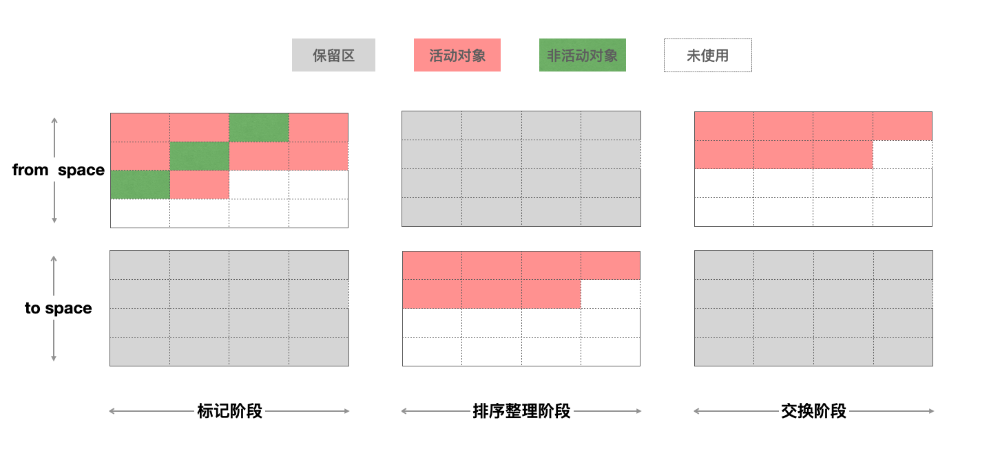
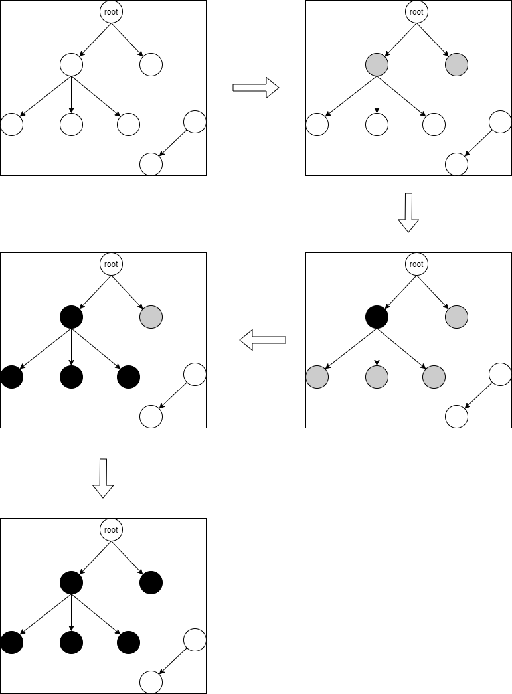
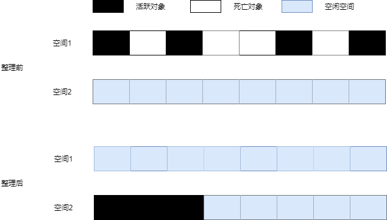
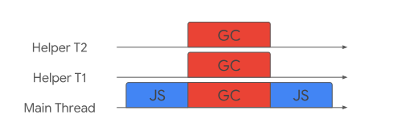

# v8引擎的垃圾回收机制

## 内存管理

### 内存生命周期

不管什么程序语言，内存生命周期基本是一致的：   

* 分配你所需要的内存

* 使用分配到的内存（读、写）

* 不需要时将其释放\归还

### JavaScript 的内存分配

#### 初始化

在编写JavaScript程序时，开发人员不需要关心内存是怎么分配的，因为JavaScript 在定义变量时就完成了内存分配

``` js
var n = 123; // 给数值变量分配内存
var s = "azerty"; // 给字符串分配内存

var o = {
  a: 1,
  b: null
}; // 给对象及其包含的值分配内存

// 给数组及其包含的值分配内存（就像对象一样）
var a = [1, null, "abra"];

function f(a){
  return a + 2;
} // 给函数（可调用的对象）分配内存

// 函数表达式也能分配一个对象
someElement.addEventListener('click', function(){
  someElement.style.backgroundColor = 'blue';
}, false);
```

#### 使用值

使用值的过程实际上是对分配内存进行读取与写入的操作。读取与写入可能是写入一个变量或者一个对象的属性值，甚至传递函数的参数。

#### 当内存不再需要使用时释放

大多数内存管理的问题都在这个阶段。在这里最艰难的任务是找到“哪些被分配的内存确实已经不再需要了”。它往往要求开发人员来确定在程序中哪一块内存不再需要并且释放它。

高级语言解释器嵌入了“垃圾回收器”，它的主要工作是跟踪内存的分配和使用，以便当分配的内存不再使用时，自动释放它。这只能是一个近似的过程，因为要知道是否仍然需要某块内存是无法判定的（无法通过某种算法解决）。

## 关于垃圾回收

在Chrome中，v8被限制了内存的使用（64位约1.4G/1464MB ， 32位约0.7G/732MB），为什么要限制呢？

1. 表层原因是，V8最初为浏览器而设计，不太可能遇到用大量内存的场景

2. 深层原因是，V8的垃圾回收机制的限制（垃圾回收会阻塞线程的执行，如果内存比较大，遍历回收的时间也将大大的增加，最终对于应用来说是无法接受的）

垃圾回收机制自动地帮开发人员做了很多内存优化操作，使得开发人员不必关注内存释放问题。v8中的垃圾回收机制主要使用了分代回收机制，对新生代和老生代分别采用了不同的算法进行垃圾回收，使得回收效率能最大化。

## 分代回收

在JavaScript中，绝大多数对象的生存期很短，只有某些对象的生存期较长。为利用这一特点，V8将堆分为新生代和老生代。

* 新生代中存放的是存活时间短的对象，并且划分有两个等大小的空间（From空间和To空间）

* 老生代中存放的存活时间久的对象


对象起初会被分配在新生区（通常很小，只有1-8 MB，取决于行为）。在新生区的内存分配比较简单：首先有一个指向内存的指针，当新对象进入内存时，指针会进行移动，当指针移动到新生区的末尾时，就会进行一次小周期的垃圾回收，清除新生区中不活跃的对象。

在经过多次小周期回收之后，对于活跃超过2个小周期但然后没被清除的对象，则将其移动至老生区，进行大周期的垃圾回收。大周期进行的并不频繁，一次大周期通常是在移动足够多的对象至老生区后才会发生，至于足够多到底是多少，则根据老生区自身的大小和程序的动向来定。

那么，为什么大周期进行的并不频繁？

按照官方的说法，以1.5G的垃圾回收堆内存为例，v8做一次小的垃圾回收需要50ms以上，做一次非增量式的垃圾回收甚至要1s以上。如果垃圾回收发生比较频繁的话，势必会让应用性能和响应能力直线下降。

### 新生代垃圾回收 - Scavenge

新生代的垃圾回收使用了Scavenge算法，它是按照Cheney的算法实现的。

> Cheney 算法是一种采用复制的方式实现的垃圾回收算法。它将堆内存一分为二，每一部分空间成为 semispace。在这两个 semispace 空间中，只有一个处于使用中，另一个处于闲置中。处于使用中的 semispace 空间成为 From 空间，处于闲置状态的空间成为 To 空间。当我们分配对象时，先是在 From 空间中进行分配。当开始进行垃圾回收时，会检查 From 空间中的存活对象，这些存活对象将被复制到 To 空间中，而非存活对象占用的空间将被释放。完成复制后， From 空间和 To 空间的角色发生对换。简而言之，在垃圾回收的过程中，就是通过将存活对象在两个semispace空间之间进行复制。

下面通过一个例子来演示



Scavenge的缺点是只能使用堆内存中的一半，是典型的牺牲空间换取时间的算法。但Scavenge由于只复制存活对象，而绝大多数对象的生存期很短，所以它在时间效率上有优异的表现。

#### 晋升

对一个对象在新生代经过多次复制以然存活时，它将会被认为是生命周期较长的对象，之后这个对象会被移动到老生代进行管理。对象从新生代移动到老生代的过程称为晋升。

对象晋升的条件主要有两个：

* 对象经历过了Scavenge回收

* To空间使用已经超过了25%

为什么To空间使用超过25%，对象就会直接晋升到老生代空间？

主要是经过Scavenge回收之后，To空间就会变成From空间，如果To空间使用占比较高，将会影响后续新对象的分配。

### 写屏障

上面我们说的Scavenge算法实现垃圾回收是发生在新生代中，但如果新生代中某个对象存在仅有一个指向它的指针，而这个指针恰好是在老生代的对象中，显然新生代中的这个对象是不能被回收的。但我们也并不希望将老生区再遍历一次，因为老生区中的对象很多，这样做一次消耗太大。

为了解决这个问题，实际上在写缓冲区中有一个列表(我们称之为CrossRefList)，这个列表中记录了所有老生代对象指向新生代的情况。新生代中新对象诞生的时候，并不会有指向它的指针，而当一个对象从新生代晋升到老生代，这个对象如果存在指向新生代中的对象，那么CrossRefList便会记录这个跨区指向。由于这种记录行为总是发生在写操作时，它被称为`写屏障`。

你可能会好奇，如果每次进行写操作都要经过写屏障，岂不是会多出大量的代码么？没错，这就是垃圾回收机制的代价之一。但情况没你想象的那么严重，写操作毕竟比读操作要少。

### 老生代垃圾回收 - Mark-Sweep & Mark-Compact

Scavenge算法对于快速回收、整理碎片存效果很好，但对于大片内存则消耗过大。因为Scavenge算法需要From和To两个空间，这对于小片内存尚可，而对于超过数MB的内存就开始变得不切实际了。所以我们对老生代的垃圾回收采取另外两种相互较为接近的算法：Mark-Sweep算法与Mark-Compact算法。

这两种算法都包含了两个阶段：标记阶段，清除或整理阶段。

#### 标记阶段

在标记阶段，V8 使用的是一种三色 marking（tricolor marking）的算法来标记对象的状态。

* 如果一个对象的状态为白，那么它尚未被垃圾回收器访问，在回收开始阶段，所有对象均为白色，当回收结束后，白色对象均不可达。

* 如果一个对象的状态为灰，那么它已被垃圾回收器访问，但它产生的引用仍未全部被处理完毕。

* 如果一个对象的状态为黑，则它不仅被垃圾回收器访问，而且它产生的引用全部被处理完毕。

当老生代 GC 启动的时候，V8 会扫描老生代的对象，沿着引用做标记（mark），将这些标记保留在对应的 marking bitmap 里，大概的流程如下。

**step1：** 最开始的时候所有的非根对象带有的标记都是白色的。

**step2：** 接着 V8 将根对象直接引用的对象放进一个显式的栈，并标记它们为灰色。

**step3：** 接下来，V8 从这些对象开始做深度优先搜索，每访问一个对象，就将它 pop 出来，标记为黑色。

**step4：** 然后将它引用的所有白色对象进行step2的操作。

这样，最后老生代的对象就只有黑色（不可回收）和白色（可以回收）两种了。

下面用例子来演示



标记算法执行完毕后，我们可以选择清理或是整理，这两个算法都可以收回内存。

#### 清除或整理阶段

* 清除阶段

清理算法扫描连续存放的死对象，将其变为空闲空间，即在标记阶段之后被标记为白色状态的对象将被清除。


从上图我们可以看到，当死对象被清除之后，会产生很多内存碎片。

* 整理阶段

整理算法则是将老生代中的所有存活的对象都转移到另一个空间上，这样原来的空间就可以直接还给操作系统了。



那么，v8是怎么决定使用Mark-Sweep还是使用Mark-Compact的呢？

V8主要使用Mark-Sweep，在空间不足以对从新生代中晋升过来的对象进行分配时才使用Mark-Compact。

### 全停顿 Stop-The-World

由于垃圾回收是在JS引擎中进行的，而Mark-Compact算法在执行过程中需要移动对象，而当活动对象较多的时候，它的执行速度不可能很快，为了避免JavaScript应用逻辑和垃圾回收器的内存资源竞争导致的不一致性问题，垃圾回收器会将JavaScript应用暂停，这个过程，被称为全停顿（stop-the-world）。

在新生代中，由于空间小、存活对象较少、Scavenge算法执行效率较快，所以全停顿的影响并不大。而老生代中就不一样，如果老生代中的活动对象较多，垃圾回收器就会暂停主线程较长的时间，使得页面变得卡顿。

## 优化 Orinoco

orinoco为V8的垃圾回收器的项目代号，为了提升用户体验，解决全停顿问题，它利用了增量标记、懒性清理、并发、并行来降低主线程挂起的时间。

### 增量标记 - Incremental marking

增量是主线程间歇性地做少量工作的地方。我们不会在增量暂停中执行整个 GC，只是 GC 所需总工作的一小部分。这更困难，因为 JavaScript 在每个增量工作段之间执行，这意味着堆的状态发生了变化，这可能会使之前增量完成的工作无效。从图中可以看出，这并没有减少在主线程上花费的时间（实际上，它通常会略微增加），它只是随着时间的推移而分散。这仍然是解决我们原始问题之一的好技术：主线程延迟。通过允许 JavaScript 间歇运行，但也继续垃圾收集任务，应用程序仍然可以响应用户输入并在动画上取得进展。

为了降低全堆垃圾回收的停顿时间，增量标记将原本的标记全堆对象拆分为一个一个任务，让其穿插在JavaScript应用逻辑之间执行，它允许堆的标记时发生5-10ms的停顿。

增量标记在堆的大小达到一定的阈值时启用，启用之后每当一定量的内存分配后，脚本的执行就会停顿并进行一次增量标记。

增量标记和普通标记不同的是，对象的引用可能会发生变化，因为程序是间歇性执行的，所以有可能在某一次增量标记小任务执行之后，JavaScript应用逻辑修改了标记对象的引用，于是我们不得不再度启用写屏障。


### 懒性清理 - Lazy sweeping

增量标记完成后，惰性清理就开始了。所有的对象已被处理，因此非死即活，堆上多少空间可以变为空闲已经成为定局。此时我们可以不急着释放那些空间，而将清理的过程延迟一下也并无大碍。因此无需一次清理所有的页，垃圾回收器会视需要逐一进行清理，直到所有的页都清理完毕。

在两段的GC程序之间，引用关系可能发生了变化。所以，这种GC算法也要写屏障，来记录引用关系的变化。虽然这种方式控制了中断最高时间，但是由于中断次数增加，GC总时间是增加的。

### 并发 - Concurrent

并发式GC允许在在垃圾回收的同时不需要将主线程挂起，两者可以同时进行，只有在和辅助线程做一些同步时时需要产生了很小的开销。但是这种方式也要面对增量回收的问题，就是在垃圾回收过程中，由于JavaScript代码在执行，堆中的对象的引用关系随时可能会变化，所以也要进行写屏障操作。


### 并行 - Parallel

并行是主线程和辅助线程同时执行大致相等的垃圾回收工作，但这仍然是一种“Stop-The-World”的方法，但现在垃圾回收所耗费的时间等于总时间除以参与的线程数量（加上一些同步开销）。




## 结束语：

在写这篇文章的过程中，进行了大量资料的查阅，特别标记阶段使用三色标记，网上对于标记的描述各有不同，但在阅读了[A tour of V8: Garbage Collection](http://jayconrod.com/posts/55/a-tour-of-v8-garbage-collection)和[解读 V8 GC Log（二）: 堆内外内存的划分与 GC 算法](https://developer.aliyun.com/article/592880)之后，决定使用三色标记作为标记阶段的算法。

如您还想对垃圾回收有更加深入的了解，推荐您阅读《Garbage Collection》这本书，并且可以阅读[v8博客](https://v8.dev/blog)的相关文章。

文章难免会存在一些疏漏，如果您在阅读的过程中有发现任何问题，欢迎指出。

## 参考资料：

* http://jayconrod.com/posts/55/a-tour-of-v8-garbage-collection

* https://v8.dev/blog/trash-talk

* https://developer.aliyun.com/article/592880

* https://developer.mozilla.org/zh-CN/docs/Web/JavaScript/Memory_Management

* https://liaodanqi.me/2019/07/31/gc-copying/

* https://juejin.cn/post/6876638765025067015

* https://juejin.cn/post/6844903859089866760

* 《深入浅出Node.js》.朴灵

* 《JavaScript高级程序设计(第4版)》.Matt Frisbie
