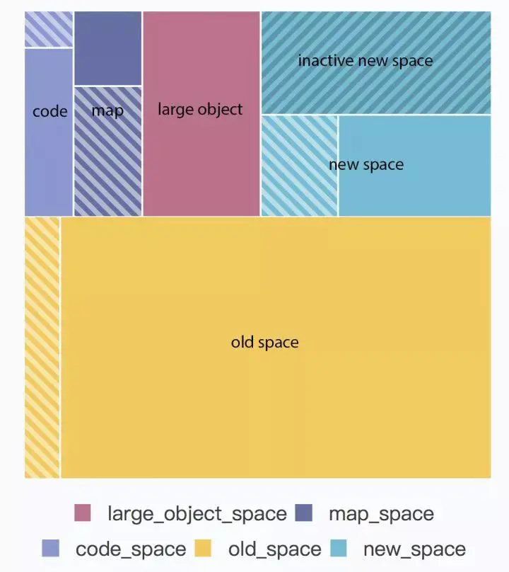

# v8引擎的垃圾回收机制

> 举一个例子，内存溢出

## 内存限制

``` js
process.memoryUsage()

{
  rss: 24428544,
  heapTotal: 5308416,
  heapUsed: 3434096,
  external: 1685231,
  arrayBuffers: 83647
}

```

* heapTotal 和 heapUsed 指的是 V8 的内存使用情况。

* external 指的是绑定到 V8 管理的 JavaScript 对象的 C++ 对象的内存使用。

* rss，Resident Set Size，是进程在主内存设备（即总分配内存的一个子集）中占用的空间量，包括所有 C++ 和 JavaScript 对象和代码。

* arrayBuffers 是指为 ArrayBuffer 和 SharedArrayBuffer 分配的内存，包括所有 Node.js Buffer。 这也包含在 external 值中。 当 Node.js 用作嵌入式库时，此值可能是 0，因为在这种情况下可能不会跟踪 ArrayBuffer 的分配。

以下仅针对于64位操作系统的情况

堆内存 = 4 * reserved_semispace_size + max_old_generation_size_ = 1464 ≈ 1.4G

<!-- ## 新生代 -->

两个reserved_semispace_size，每个16M

## 回收策略

在浏览器的发展史上，用到过两种主要的标记策略：标记清理和引用计数。

### 引用计数

另一种没那么常用但却是最初级的垃圾回收策略是引用计数（reference counting）。

* 声明变量并给它赋一个引用值时，这个值的引用数为 1

* 如果同一个值又被赋给另一个变量，那么引用数加 1

* 如果保存对该值引用的变量被其他值给覆盖了，那么引用数减 1

* 当一个值的引用数为 0 时，就说明没办法再访问到这个值了，因此可以安全地收回其内存了

下面举个例子：

``` js
var obj1 = {} // 这个对象被obj1引用，引用数count为1
var obj2 = obj1 // 对象又被obj2引用，count加1，变为2

obj1 = null // obj1被覆盖，count减1，变成1
obj2 = null // obj2也被覆盖，count减1，变成0

// 由于引用数变成0，所以这个对象无法被访问，将被内存回收
```

#### 引用计数存在的问题

* 无法处理循环引用的对象

在下面的例子中，两个对象被创建，并互相引用，形成了一个循环。它们被调用之后会离开函数作用域，所以它们已经没有用了，可以被回收了。然而，引用计数算法考虑到它们互相都有至少一次引用，所以它们不会被回收。

``` js
function problem() {
 let objectA = new Object(); 
 let objectB = new Object(); 
 objectA.someOtherObject = objectB; 
 objectB.anotherObject = objectA; 
}
problem()
```

### 标记清除

JavaScript 最常用的垃圾回收策略是标记清理（mark-sweep）。从2012年起，所有现代浏览器都使用了标记-清除垃圾回收算法。所有对JavaScript垃圾回收算法的改进都是基于标记-清除算法的改进。

* 垃圾回收程序运行的时候，会标记内存中存储的所有变量，包括了可达变量和不可达变量

* 所有在上下文中的变量，以及被在上下文中的变量引用的变量的标记去掉，即不可达变量标记保留

* 在此之后再被加上标记的变量就是待删除的了，原因是任何在上下文中的变量都访问不到它们了

* 随后垃圾回收程序做一次内存清理，销毁带标记的所有值并收回它们的内存

下面举个例子：

``` js
window.a = {}
window.b = {}

window.a = null

// 1.当垃圾回收程序运行时，a和b指向的对象都会被标记

// 2.当程序执行完后，由于a一开始指向的对象没有被引用，所以标记保留；b指向的对象还是被引用，所以标记清除

// 3.清除标记的引用，a一开始指向的对象被销毁，对应内存得到回收
```

## V8回收机制

v8的回收机制基于`分代式垃圾回收机制`，根据对象的存活时间主要将堆内存分为新生代和老生代，新生代的对象为存活时间较短的对象，老生代中的对象为存活时间较长或常驻内存的对象。


为什么要将内存进行分代划分呢？因为不同对象的生命周期有差异，所以对不同生命周期的对象实施不同的垃圾回收算法，可以提高回收效率。

### 内存划分结构

上面我们说了堆内存主要划分为新生代和老生代，下面我们再深入了解堆内存的整体结构。



#### 新生代

以下的空间都被划分到新生代中。

* **new space**，大多数的对象开始都会被分配在这里，这个区域相对较小但是垃圾回收特别频繁，该区域被分为两半，一半用来分配内存，另一半用于在垃圾回收时将需要保留的对象复制过来。

* **inactive new space**，以下的代码是v8中的源码，从代码的说明我们可以知道，新生代实际上是保留了2个`semi space`，所以由此我们可以知道`inactive new space`就是新生代中保留的空间。

``` js
 // Returns the maximum amount of memory reserved for the heap. For 
 // the young generation, we reserve 4 times the amount needed for a 
 // semi space. The young generation consists of two semi spaces and 
 // we reserve twice the amount needed for those in order to ensure 
 // that new space can be aligned to its size 
 intptr_t MaxReserved() { 
 	return 4 * reserved_semispace_size_ + max_old_generation_size_; 
 }
```

#### 老生代

以下的空间都被划分到老生代中。

* **old space**，保存的是老生代里的普通对象，这些对象大部分是从`new space`晋升而来。

* **large object space**，当 V8 需要分配一个 1MB 的页（减去 header）无法直接容纳的对象时，就会直接在`large object space`而不是`new space`分配。在垃圾回收时，`large object space`里的对象不会被移动或者复制（因为成本太高）

* **map space**，所有在堆上分配的对象都带有指向它的“隐藏类”的指针，这些“隐藏类”是 V8 根据运行时的状态记录下的对象布局结构，用于快速访问对象成员，而这些“隐藏类”（Map）就保存在`map space`。

* **code space**，在针对小内存设备的 ignition 解释器推出之前，V8 长期以来都只有编译器（JavaScript 是脚本语言不代表它一定会被解释执行），包括一个无优化的基线编译器（baseline compiler）和一个优化编译器（optimizing compiler，目前默认是 CrankShaft，还有一个升级版的 TurboFan）。这些编译器针对运行平台架构编译出的机器码（存储在可执行内存中）本身也是数据，连同一些其它的元数据（比如由哪个编译器编译，源代码的位置等），放置在`code space`中。

### Scavenge算法

### Mark-Sweep & Mark-Compact

### 优化

#### 增量标记

#### 增量整理

#### 延迟清理

#### 并行标记

#### 并行清理


结束语：

V8主要使用Mark-Sweep，在空间不足以对从新生代中晋升过来的对象进行分配时才使用Mark-Compact


## 参考资料：

* https://developer.aliyun.com/article/592880

* https://segmentfault.com/a/1190000038175558

* https://juejin.cn/post/6876638765025067015

* https://juejin.cn/post/6844904016325902344

* https://developer.mozilla.org/zh-CN/docs/Web/JavaScript/Memory_Management

* 《深入浅出Node.js》.朴灵

* 《JavaScript高级程序设计(第4版)》.Matt Frisbie
